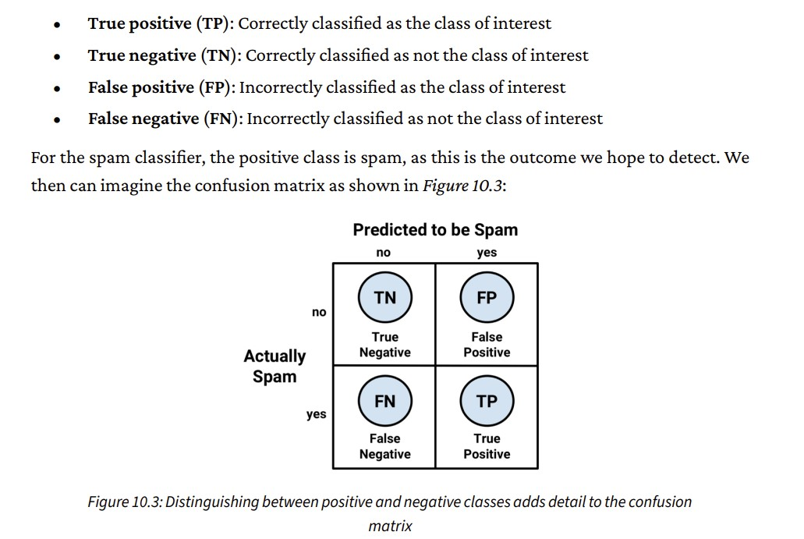
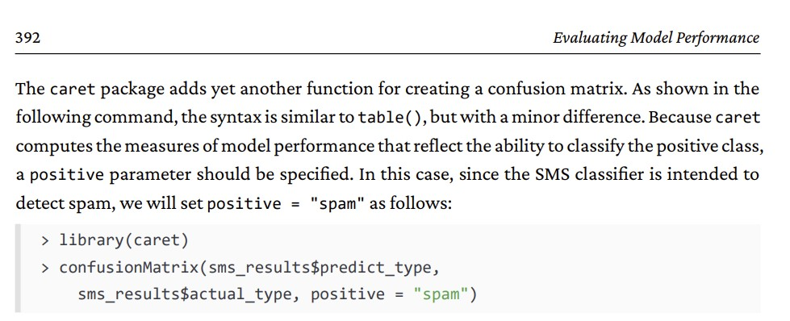

```{r setup, include=FALSE}
knitr::opts_chunk$set(echo = TRUE)
```

## R Markdown

This is an R Markdown document. Markdown is a simple formatting syntax for authoring HTML, PDF, and MS Word documents. For more details on using R Markdown see <http://rmarkdown.rstudio.com>.

When you click the **Knit** button a document will be generated that includes both content as well as the output of any embedded R code chunks within the document. You can embed an R code chunk like this:


Note that the `echo = FALSE` parameter was added to the code chunk to prevent printing of the R code that generated the plot.

```{r}
#install.packages("jpeg")
#install.packages("caret")
library(caret)
library(knitr)
library(gmodels)
library(jpeg)
library(e1071)
library(kernlab)
```

```{r}

url <- "https://raw.githubusercontent.com/derekriceX/SVM_Learning/main/RSM_eqn_1000.csv" # Paste the URL you copied here
data <- read.csv(url)
data$Class <- as.factor(data$Class)
# You can now work with 'data' as a data frame in R
head(data)


# Train SVR model
model <- ksvm(Class ~ X1+X2+X3, data = data, kernel = "rbfdot", C = 1)


#support_vectors <- model_svm$SV
#coefficients <- model_svm$coefs
#intercept <- model_svm$rho

#support_vectors
#coefficients
#intercept


predict <- predict(model, data)
head(predict)
table(predict, data$Class)

agreement <- predict == data$Class
table(agreement)
prop.table(table(agreement))


```

```{r}

cost_values <- c(1, seq(from = 4, to = 20, by = 2))
accuracy_values <- sapply(cost_values, function(x) {
 set.seed(12345)
 m <- ksvm(Class ~ X1+X2+X3, data = data, kernel = "rbfdot", C = x)
 pred <- predict(m, data)
 agree <- ifelse(pred == data$Class, 1, 0) 
 accuracy <- sum(agree) / nrow(data)
 return (accuracy)
 })
plot <-plot(cost_values, accuracy_values, type = "b")
print(plot)

jpeg("svm_plot.jpg")
plot <-plot(cost_values, accuracy_values, type = "b")
dev.off()

```


```{r}
model <- ksvm(Class ~ X1+X2+X3, data = data, kernel = "rbfdot", C = 12)
predict <- predict(model, data)

table(predict, data$Class)
agreement <- predict == data$Class
table(agreement)
prop.table(table(agreement))


```
```{r}
sms_results <- read.csv("sms_results.csv", stringsAsFactors = TRUE)
head(sms_results)
head(subset(sms_results, prob_spam > 0.40 & prob_spam < 0.60)) # displays errors made with prob ~ 0.5
head(subset(sms_results, actual_type != predict_type)) # displays errors made with prob ~ 1

```

```{r echo=FALSE}
#library(knitr)

table(sms_results$actual_type, sms_results$predict_type) # prints a Confusion Matrix

#library(gmodels)
CrossTable(sms_results$actual_type, sms_results$predict_type)
```
```{r}
#library(caret)

confusionMatrix(sms_results$predict_type,sms_results$actual_type, positive = "spam") # note postive = spam


```